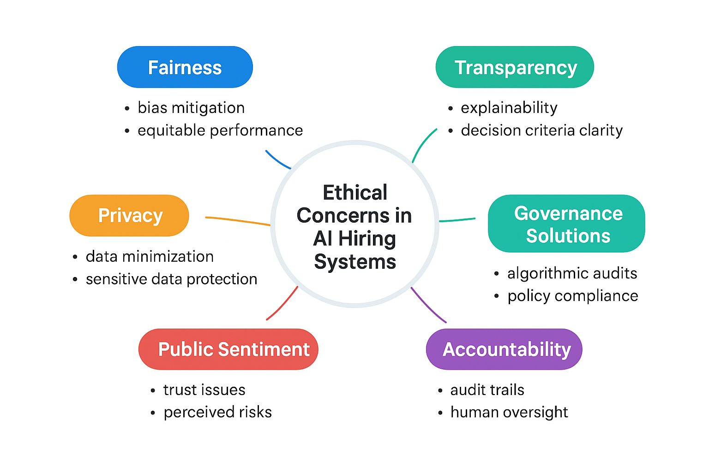
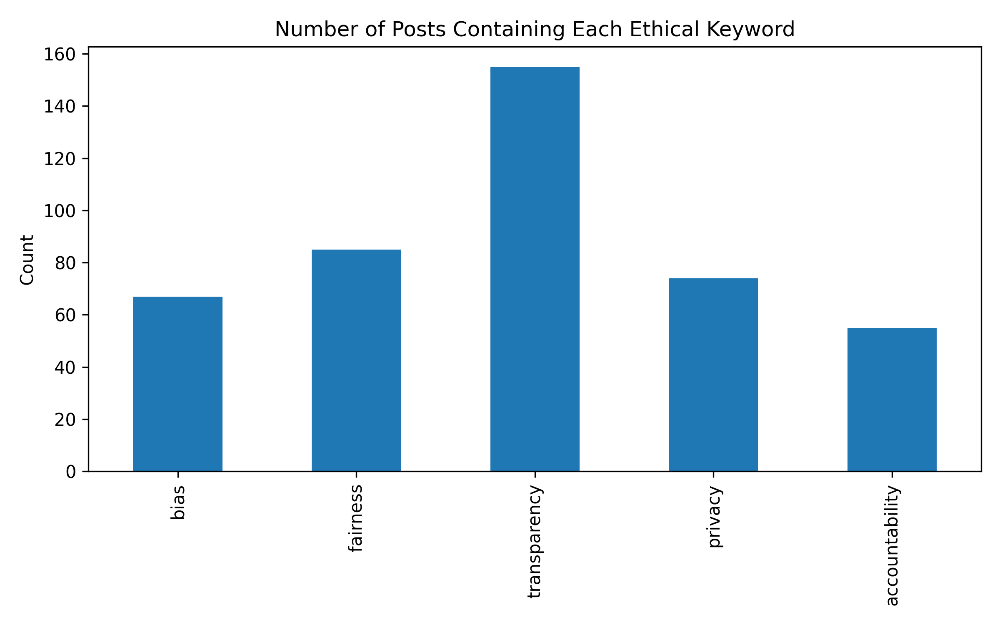
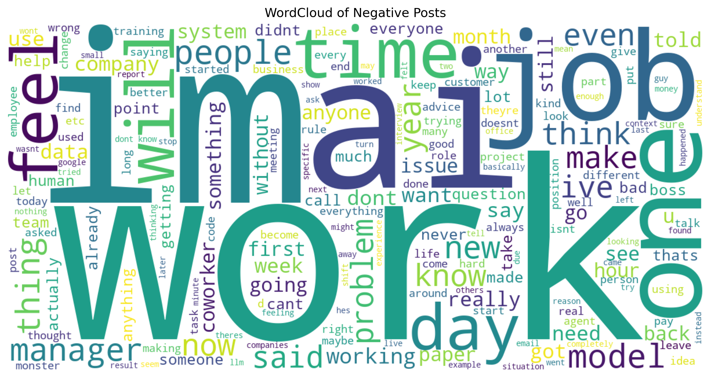
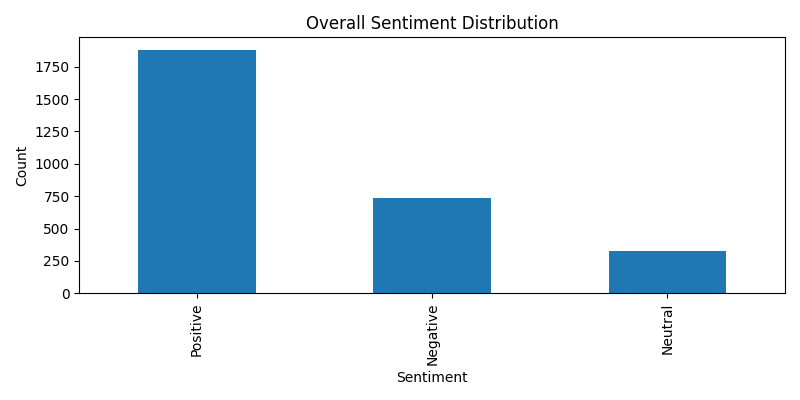

# 🤖 Public Perception, Fairness, and Algorithmic Bias in AI Hiring
**A Data-Driven Study of Ethical Concerns using NLP and Reddit Discourse**

## 📖 Project Overview
This project investigates how the public perceives the integration of Artificial Intelligence (AI) in workplace recruitment and employee evaluation. By analyzing a dataset of **2,998 Reddit posts**, specifically identifying **729 hiring-related discussions**, the study explores emerging ethical gaps in fairness, transparency, and accountability.

## 🎯 Why This Study? (Research Question)
Organizations increasingly rely on automated résumé screening, algorithmic candidate ranking, and AI-driven interview assessments. [cite_start]This project asks: **How can organizations ensure fairness, transparency, and accountability when using AI for hiring and employee evaluation?**. Understanding public sentiment offers critical insight into the ethical gaps that remain unresolved as these systems grow more influential.

## 🛠️ Methodology: How We Did It
The project follows a rigorous Data Science pipeline to extract insights from unstructured social media data:
* **Data Collection**: 2,998 Reddit posts related to workplace AI were collected and filtered for hiring-specific terms like "hire," "interview," "candidate," and "application".
* **NLP Preprocessing**: Applied text cleaning through tokenization, punctuation removal, stopword filtering, and lemmatization.
* **Sentiment Analysis**: Computed sentiment scores using **VADER** to categorize discussions into positive, negative, and neutral categories.
* **Thematic Detection**: Used ethical keywords—*bias, fairness, transparency, privacy,* and *accountability*—to identify relevant concerns.
* **Statistical Validation**: Performed a **t-test** to compare average sentiment between hiring and non-hiring discussions to determine distinct emotional tones.
* **Topic Modeling**: Applied **Latent Dirichlet Allocation (LDA)** to uncover thematic differences in user discussions.

## 📊 What We Achieved (Key Results)
* **Transparency as a Priority**: Transparency was identified as the most prevalent ethical concern, followed by fairness and privacy.
* **Emotional Intensity**: Hiring discussions were found to be statistically more personally and emotionally charged compared to general technical AI talk.
* **Negative Sentiment Drivers**: Discussions involving **Accountability** and **Bias** skew more negative, reflecting unresolved harms and skepticism.
* **Thematic Divide**: Topic modeling revealed that hiring posts revolve around personal career transitions and uncertainty, while non-hiring posts remain solution-focused and technical.

---

### Visualizing the Analysis
  
*Figure 1: Mind map of ethical concerns in AI hiring systems, including fairness, transparency, and accountability.*

  
*Figure 2: Frequency of ethical keywords in hiring-related Reddit posts, showing Transparency as the leading concern.*

  
*Figure 3: Common themes in negative hiring posts highlight issues with "models," "managers," and "jobs".*

  
*Figure 4: Distribution of sentiment across all Reddit posts about AI in the workplace.*

---

## 🚀 Setup & Installation

### 1. Reddit API Credentials
To fetch data, you must have a Reddit developer account:
* Visit [Reddit App Preferences](https://www.reddit.com/prefs/apps).
* Click **"create app"** or **"create another app"**.
* **Name**: `AI_Hiring_Analysis` (or your preferred name).
* **App Type**: Select **script**.
* **Redirect URI**: Use `http://localhost:8080`.
* Click **"create app"** to get your **Client ID** (under the app name) and **Client Secret**.

### 2. Environment Variables
Create a file named `.env` in your root directory. This project uses the `python-dotenv` library to keep your keys safe. Add your credentials like this:
```text
REDDIT_CLIENT_ID=your_client_id_here
REDDIT_CLIENT_SECRET=your_client_secret_here
REDDIT_USER_AGENT=your_app_name_here
```

### 3. Install Dependencies

Open your terminal in VS Code and run the following command to install the required Python libraries:
pip install -r requirements.txt

### 4. Run the Analysis

* Open the ai_bias.ipynb notebook in VS Code or Jupyter.

* Ensure your kernel is set to your Python environment.

* Execute the cells in order to reproduce the data fetching, cleaning, and visualizations.
